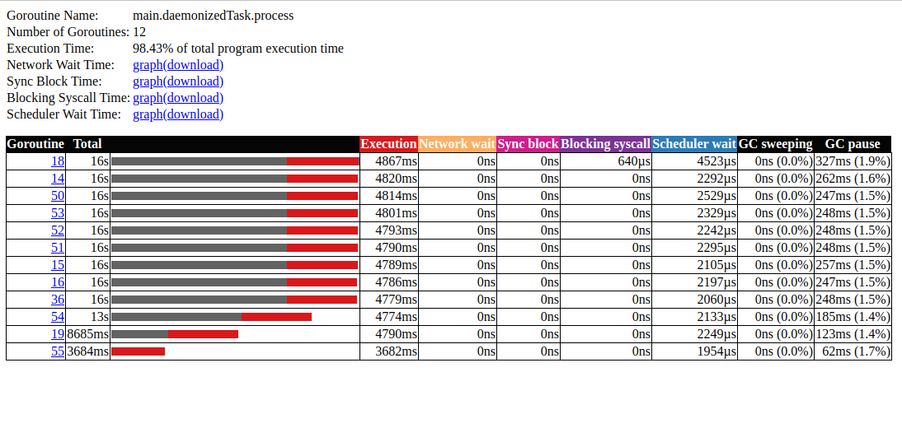

# staking goroutines

```bash
cd 01_staking_goroutines
wget -O trace.out http://localhost:8080/debug/pprof/trace?seconds=60
go tool trace trace.out
```

### Summary



All goroutines spend about 16 seconds.

4 seconds for sorting random numbers.

12 seconds sleeping.

Red part means "execution time".

Dark grey means "sleep/idle time" I guess.


**backgroundRead** has fast (45µs) "Execution" and long (60s) "Network wait" time.

Maybe it's process, that serve trace collection HTTP request.


