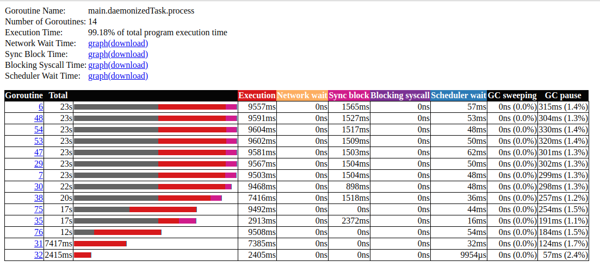
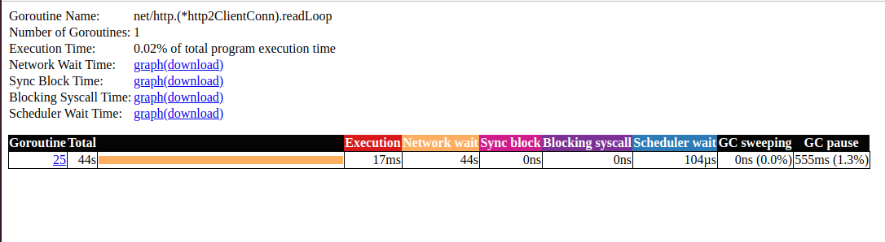
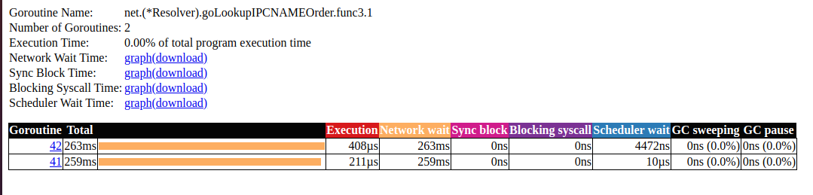

# staking goroutines with ping lag

Install util for network lag emulation

```bash
sudo apt update
sudo apt-get install iproute2
```

Add 250ms lag

```bash
# my network interface is "wlp1s0"
export MY_NETWORK_INTERFACE=wlp1s0
sudo tc qdisc add dev ${MY_NETWORK_INTERFACE} root netem delay 250ms
```

Run application

Let's start to collect trace:

```bash
cd 02_stacking_goroutines_slow_network
wget -O trace.out http://localhost:8080/debug/pprof/trace?seconds=60
go tool trace trace.out
```

Disable network lag

```bash
sudo tc qdisc del dev ${MY_NETWORK_INTERFACE} root netem
```

### Summary



<strike>I expect "Network wait" should be greater than 0.</strike>

<strike>However, "Network wait" was not changed and "Sync block" equals ~1500ms.</strike>



Don't know what is that. I will find out it later.



<strike>Perhaps this particular panel shows how ping lag affect application.</strike>

In previous sample (**01_staking_goroutines**) "Network wait" for goLookupIPCNAMEOrder is 8245µs.

In this sample - ~260ms.

Ping lag affect goroutine that do net address resolution.
