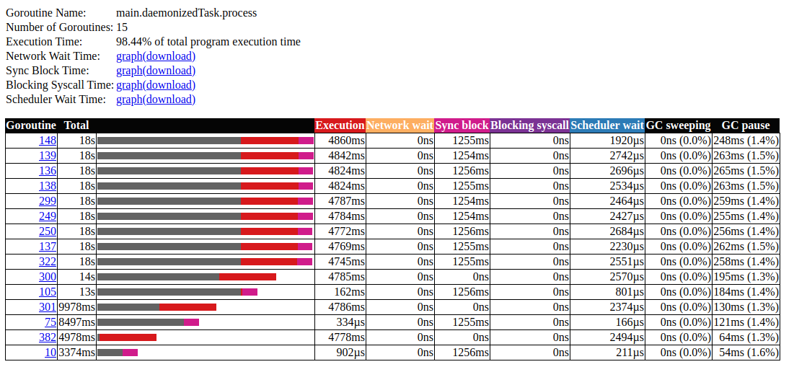

# staking goroutines with slow external service

Run ext_svc application

Run main application

Let's start to collect trace:

```bash
cd 03_stacking_goroutines_slow_external_service
wget -O trace.out http://localhost:8080/debug/pprof/trace?seconds=60
go tool trace trace.out
```

### Summary



Slow external service, that sleep (250ms) before answer, can't change "Network wait" metric too.

"Network wait" was not changed and "Sync block" equals ~1200ms.