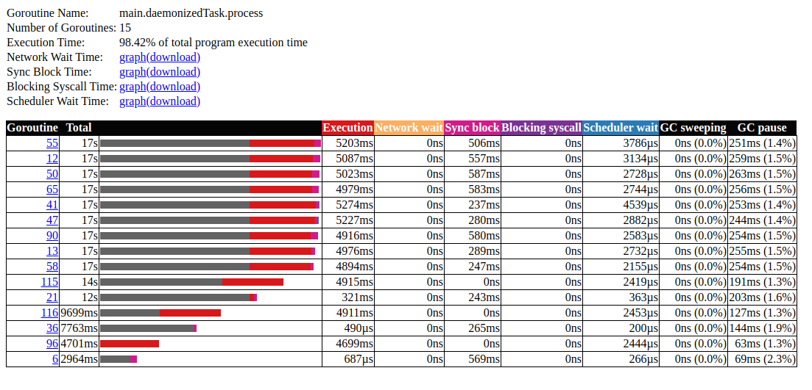
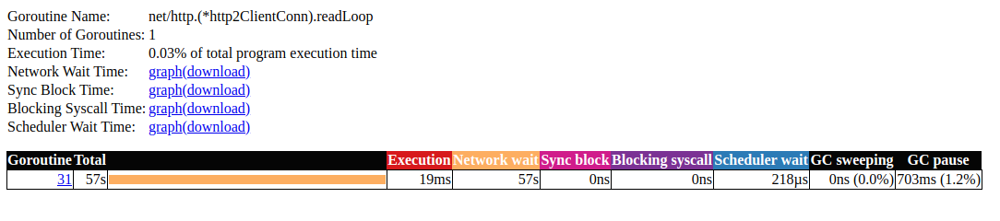
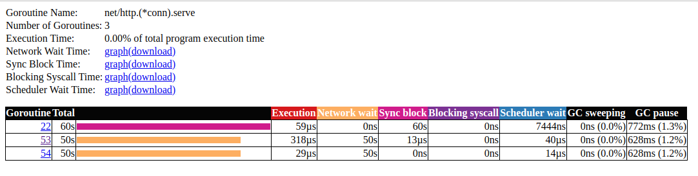

# staking goroutines with low bandwidth

Install util for network lag emulation

```bash
sudo apt update
sudo apt install wondershaper

```

Limit download and upload bandwidth

```bash
# my network interface is "wlp1s0"
export MY_NETWORK_INTERFACE=wlp1s0
sudo wondershaper ${MY_NETWORK_INTERFACE} 1024 1024
```

Run application

Let's start to collect trace:

```bash
cd 04_stacking_goroutines_slow_connection
wget -O trace.out http://localhost:8080/debug/pprof/trace?seconds=60
go tool trace trace.out
```

Disable limits

```bash
sudo wondershaper -c -a ${MY_NETWORK_INTERFACE}
sudo wondershaper clear ${MY_NETWORK_INTERFACE}

```

### Summary





